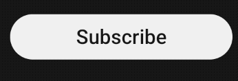

# Youtube Subscribe Button

A replica of YouTube's Subscribe button.
## Inspiration

This project was inspired by [Yash Raj's YouTube video](https://www.youtube.com/watch?v=xXI1JuOK430).

## Demo

    

        <h3>Youtube</h3>
        
    

    

        <h3>My Version</h3>
        
    

## TODO
- [ ] Add an initial delay parameter to `HoverEffectWidget` to improve the animation timing.
- [ ] Implement an efficient method to replicate the division of circles into smaller circles. Reference: [CodePen Example](https://codepen.io/driftblaze/pen/qEBZvpv).
- [ ] Use a more refined and outlined bell icon.

## Contributing

Contributions are what make the open source community such an amazing place to learn, inspire, and create. Any contributions you make are greatly appreciated.

1. **Fork the Project**
2. **Create your Feature Branch** (`git checkout -b feature/AmazingFeature`)
3. **Commit your Changes** (`git commit -m 'Add some AmazingFeature'`)
4. **Push to the Branch** (`git push origin feature/AmazingFeature`)
5. **Open a Pull Request**
